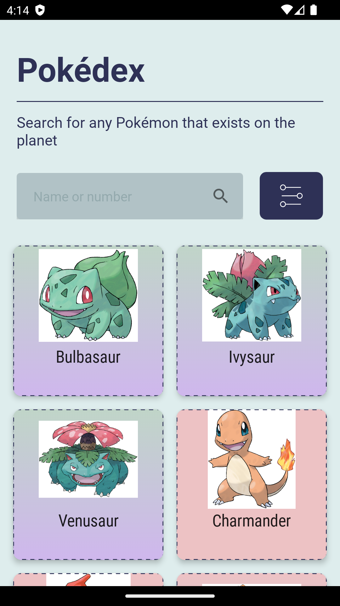
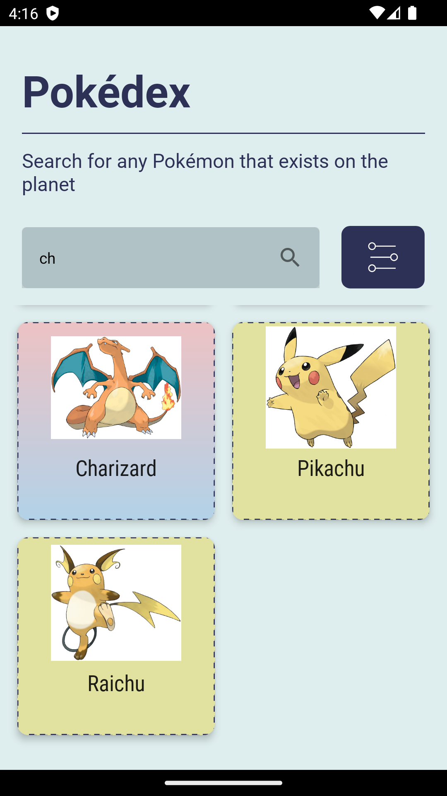
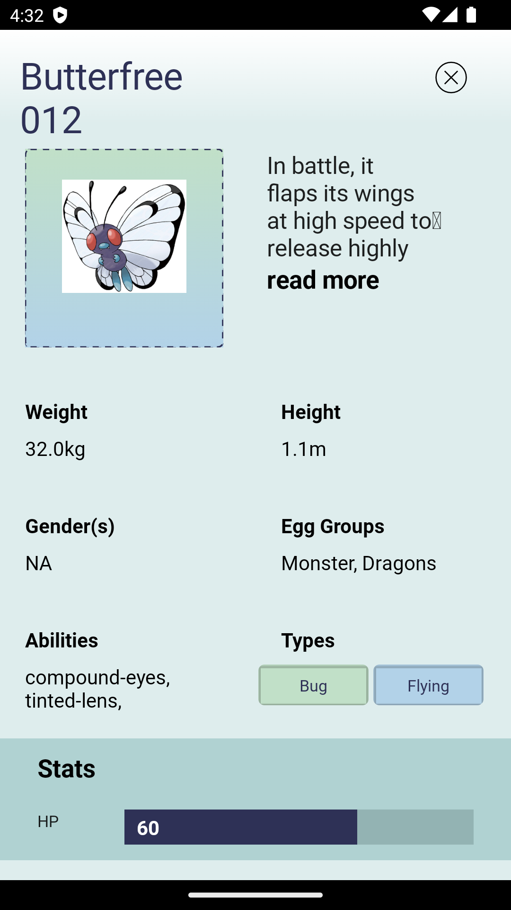
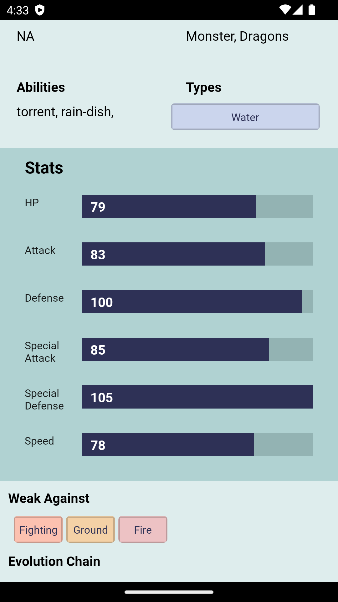
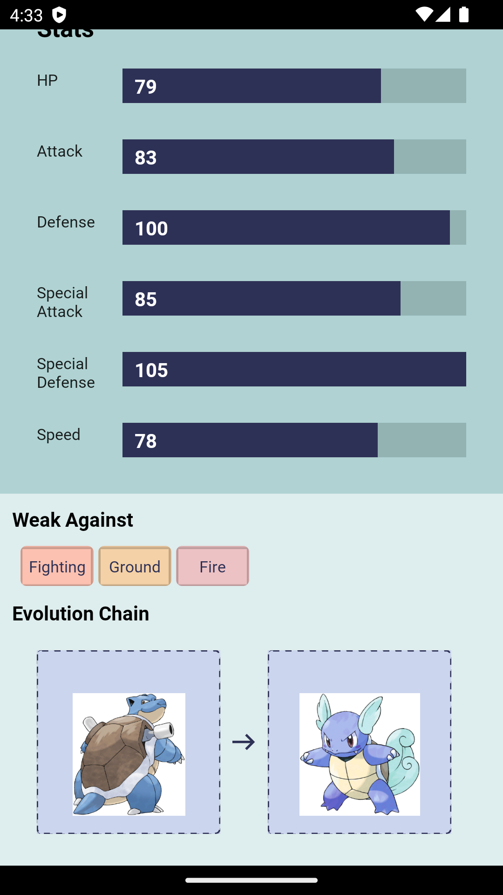
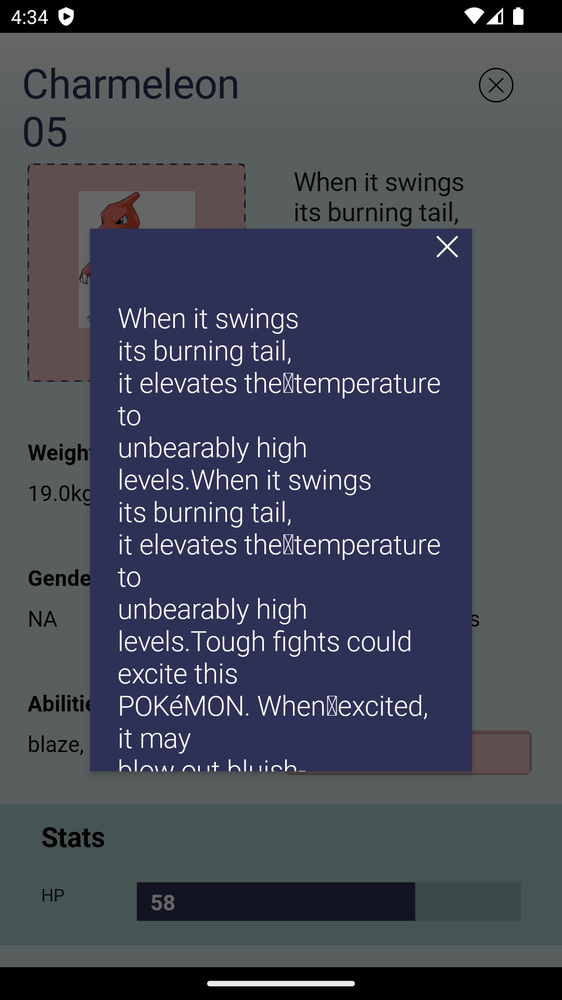

# Pokedex

 Pokedex demonstrates modern Android development with Hilt, Coroutines, Flow, Jetpack (Room, ViewModel), and Material Design based on MVVM architecture.

## Features

This application has next features.

Display pokemon image and type, weakeness, breeding, evolutions.
Search pokemon based on name and number.

## Screenshots

Tech Stack & Features

% 100 Kotlin
Jetpack Compose
Material 3
Coroutines
Hilt
Navigation
Retrofit
Memory Caching
Manual Paging
## API Reference
 
 Clean Pokedex uses https://pokeapi.co/ to get Pokemon data.

## Authors

- [@sagtiwar](https://pscode.lioncloud.net/sagtiwar)

